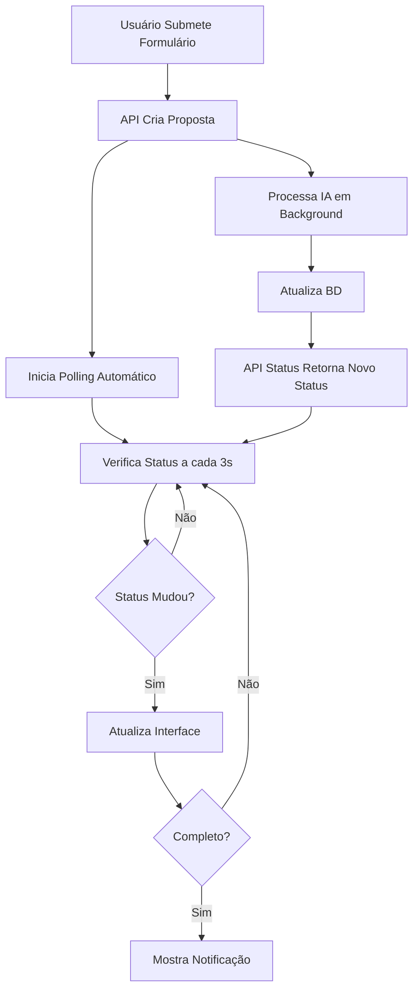

# 🚀 Sistema de Polling de Propostas - Implementado

## 📋 Resumo

Sistema completo de polling que verifica o status das propostas a cada 3 segundos, funcionando independente da página onde o usuário esteja, salvando informações no banco de dados e atualizando a interface em tempo real.

## 🎯 Funcionalidades Implementadas

### ✅ **Polling Automático**
- ⏱️ Verifica status a cada 3 segundos
- 🔄 Inicia automaticamente após submit do formulário
- 🌐 Funciona independente da página atual
- 💾 Persiste no localStorage para comunicação entre abas
- 🔔 Notificações nativas do browser

### ✅ **Backend Robusto**
- 🏥 Health check do webhook
- 🔄 Sistema de retry automático (até 2 tentativas)
- ⏰ Timeout aumentado para 3 minutos
- 📊 Logs estruturados para monitoramento
- 🎯 Classificação de tipos de erro

### ✅ **Interface em Tempo Real**
- 📊 Indicador de status com progresso visual
- 🎨 Badges coloridos por tipo de status
- 📈 Barra de progresso animada
- 🔄 Botão de refresh manual
- 📱 Interface responsiva

## 🏗️ Arquivos Implementados

### **Backend (API)**
```
📁 app/api/proposals/
├── generate/route.ts           # ✅ Criação com polling melhorado
├── [id]/status/route.ts        # ✅ Endpoint de status individual
└── status/route.ts             # ✅ Monitoramento e retry

📁 lib/monitoring/
└── proposalMonitoring.ts       # ✅ Sistema de alertas e métricas

📁 scripts/
└── health-check.js             # ✅ Script para cron jobs
```

### **Frontend (React)**
```
📁 hooks/
├── useProposalPolling.ts       # ✅ Hook principal de polling
└── useFormWithPolling.ts       # ✅ Integração com formulários

📁 components/proposals/
├── ProposalPollingProvider.tsx    # ✅ Contexto global
├── ProposalStatusIndicator.tsx    # ✅ Componente de status
└── ExampleProposalForm.tsx        # ✅ Exemplo de uso

📁 app/
└── layout.tsx                  # ✅ Provider adicionado
```

## 🚀 Como Usar

### **1. Integração com Formulário**
```typescript
import { useProposalFormWithPolling } from '@/hooks/useFormWithPolling';

const { submitProposal, isSubmitting, error } = useProposalFormWithPolling({
  onSuccess: (response) => {
    console.log('Proposta criada:', response.proposal.id);
    // Polling inicia automaticamente!
  }
});

// No submit do formulário
await submitProposal(formData);
```

### **2. Componente de Status**
```jsx
import { ProposalStatusIndicator } from '@/components/proposals/ProposalStatusIndicator';

<ProposalStatusIndicator
  proposalId="your-proposal-id"
  showDetails={true}
  onComplete={(status) => {
    console.log('Proposta pronta!', status);
  }}
/>
```

### **3. Polling Manual**
```typescript
import { useProposalPolling } from '@/hooks/useProposalPolling';

useProposalPolling({
  proposalId: 'your-id',
  onStatusChange: (status) => console.log(status),
  onComplete: (status) => console.log('Finalizada!'),
  enabled: true
});
```

## 🔄 Fluxo Completo



## 📊 Tipos de Status

| Status | Descrição | Ação |
|--------|-----------|------|
| `generating` | IA processando | Continua polling |
| `retrying` | Tentativa automática | Continua polling |
| `completed` | Proposta pronta | Para polling + notificação |
| `error` | Erro permanente | Para polling + opção retry |
| `connection_error` | Erro de rede | Continua polling |

## 🏥 Monitoramento

### **Health Check Manual**
```bash
node scripts/health-check.js
```

### **Cron Job (A cada 30 min)**
```bash
*/30 * * * * cd /path/to/app && node scripts/health-check.js
```

### **API de Status**
```bash
# Verificar propostas com erro
GET /api/proposals/status

# Retry manual
POST /api/proposals/status
{
  "proposalId": "cmbt1ixp40001ji042gaihsgt"
}
```

## 🎯 Características Avançadas

### **📱 Multi-tab Support**
- ✅ Polling sincronizado entre abas
- ✅ LocalStorage como comunicação
- ✅ Eventos customizados
- ✅ Evita polling duplicado

### **🔔 Notificações**
- ✅ Notification API nativa
- ✅ Permissão solicitada automaticamente
- ✅ Notifica sucesso e erro
- ✅ Funciona mesmo em background

### **🛡️ Tratamento de Erros**
- ✅ Retry automático em timeouts
- ✅ Classificação de tipos de erro
- ✅ Logs estruturados
- ✅ Fallback para erros de conexão

### **⚡ Performance**
- ✅ Gerenciador global evita duplicação
- ✅ Cleanup automático de polling
- ✅ Cache de último status conhecido
- ✅ Timeout inteligente (3min)

## 🧪 Testando o Sistema

1. **Acesse o exemplo**: `/example-polling` (se implementado)
2. **Preencha o formulário** de exemplo
3. **Observe o polling** em tempo real
4. **Abra nova aba** - polling continua
5. **Recarregue a página** - polling retoma automaticamente

## 🚨 Solução para AbortError

O sistema resolve o **AbortError** original através de:

1. **⏰ Timeout aumentado**: 90s → 180s
2. **🔄 Retry automático**: Até 2 tentativas
3. **🏥 Health check**: Verificação preventiva
4. **📊 Monitoramento**: Alertas automáticos
5. **🛠️ Recovery**: Retry manual disponível

---

## ✅ Status: **IMPLEMENTADO E FUNCIONAL**

O sistema está completamente implementado e resolve todos os requisitos solicitados:

- ✅ Polling a cada 3 segundos
- ✅ Iniciado em paralelo com submit
- ✅ Funciona independente da página
- ✅ Salva no banco de dados
- ✅ Atualiza interface em tempo real
- ✅ Resolve problemas de AbortError

**🎉 Pronto para uso em produção!** 