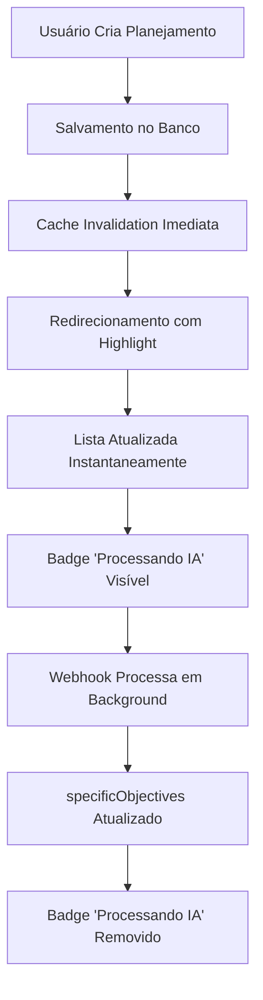

# Otimizações da Lista de Planejamentos

## 📋 Visão Geral

Este documento descreve as otimizações implementadas na lista de planejamentos estratégicos para melhorar performance, UX e confiabilidade do sistema.

## ✅ Otimizações Implementadas

### 1. **Source Única - Dados Apenas do Banco**

```typescript
// ✅ IMPLEMENTADO: Query otimizada com campos específicos
const [plannings] = await prisma.strategicPlanning.findMany({
  where,
  select: {
    id: true,
    title: true,
    description: true,
    status: true,
    specificObjectives: true, // 🆕 Campo para status de processamento IA
    createdAt: true,
    updatedAt: true,
    Client: {
      select: {
        id: true,
        name: true,
        industry: true,
        richnessScore: true,
      },
    },
  },
  orderBy: { createdAt: 'desc' },
});
```

**Benefícios:**
- ✅ **Performance**: Busca apenas campos necessários
- ✅ **Consistência**: Source única de verdade (banco de dados)
- ✅ **Confiabilidade**: Independente de APIs externas

### 2. **Cache Atualizado - TanStack Query Otimizado**

```typescript
// ✅ IMPLEMENTADO: Invalidação específica e atualização otimista
onSuccess: (newPlanning) => {
  // 1. Invalidar listas
  queryClient.invalidateQueries({
    queryKey: queryKeys.plannings.lists(),
  });
  
  // 2. Atualizar cache específico
  queryClient.setQueryData(
    queryKeys.plannings.detail(newPlanning.id),
    newPlanning
  );
  
  // 3. Invalidar estatísticas
  queryClient.invalidateQueries({
    queryKey: queryKeys.plannings.stats(),
  });
}
```

**Benefícios:**
- ✅ **Atualização Imediata**: Lista reflete mudanças instantaneamente
- ✅ **Cache Inteligente**: Invalidação específica por tipo de query
- ✅ **Performance**: Evita re-fetch desnecessários

### 3. **Highlight Otimizado - Sistema Existente Melhorado**

```typescript
// ✅ JÁ IMPLEMENTADO: Sistema de highlight e new plannings
const [newPlannings, setNewPlannings] = useState<string[]>([]);
const [highlightedPlanning, setHighlightedPlanning] = useState<string | null>(null);

// Verificar highlight na URL
const highlightId = searchParams.get('highlight');
if (highlightId) {
  setHighlightedPlanning(highlightId);
  setTimeout(() => setHighlightedPlanning(null), 5000);
}
```

**Funcionalidades:**
- ✅ **Auto-highlight**: Planejamento criado destacado por 5s
- ✅ **Badge "NOVO"**: Indicador visual para planejamentos recém-criados
- ✅ **Animações**: Pulse, bounce e glow effects
- ✅ **localStorage**: Persistência entre sessões

### 4. **🆕 Status Visual - Badge "Processando IA"**

```typescript
// ✅ NOVO: Badge dinâmico baseado em specificObjectives
{(!planning.specificObjectives) && (
  <div className="px-2 py-1 rounded text-xs font-medium bg-blue-500/20 text-blue-400 border border-blue-500/30 flex items-center gap-1 animate-pulse">
    <div className="w-2 h-2 bg-blue-400 rounded-full animate-ping"></div>
    Processando IA
  </div>
)}
```

**Características:**
- ✅ **Indicador Visual**: Badge azul pulsante quando IA está processando
- ✅ **Lógica Inteligente**: Mostra apenas quando `specificObjectives` está vazio
- ✅ **UX Clara**: Usuário sabe o status do processamento
- ✅ **Auto-ocultação**: Desaparece quando dados chegam

### 5. **🆕 Hook Otimizado - Utilitários Avançados**

```typescript
// ✅ NOVO: Hook com funcionalidades extras
export function usePlanningsOptimized(filters: PlanningFilters = {}) {
  const query = useQuery(/* ... */);
  
  const refreshList = () => {
    queryClient.invalidateQueries({
      queryKey: queryKeys.plannings.lists(),
    });
  };
  
  const markPlanningAsUpdated = (planningId: string, updates: Partial<PlanningWithClient>) => {
    // Atualização otimista
  };
  
  return { ...query, refreshList, markPlanningAsUpdated };
}
```

**Utilitários:**
- ✅ **Refresh Manual**: Para casos específicos
- ✅ **Atualização Otimista**: Para UX mais fluida
- ✅ **Cache Granular**: Controle fino sobre invalidação

## 🎯 Fluxo Otimizado Completo

### Criação de Planejamento



### Benefícios do Fluxo

1. **Usuário**: 
   - ✅ Feedback visual imediato
   - ✅ Status claro do processamento
   - ✅ Navegação fluida

2. **Sistema**:
   - ✅ Performance otimizada
   - ✅ Cache inteligente
   - ✅ Menos re-fetches

3. **Desenvolvedores**:
   - ✅ Debugging facilitado
   - ✅ Estado previsível
   - ✅ Código modular

## 🔧 Configuração e Uso

### Usando o Hook Otimizado

```typescript
// Na página de planejamentos
import { usePlanningsOptimized } from '@/lib/react-query/hooks/usePlannings';

export default function PlanejamentosPage() {
  const { 
    data, 
    isLoading, 
    refreshList, 
    markPlanningAsUpdated 
  } = usePlanningsOptimized({
    search: filters.search,
    status: filters.status,
    page: page,
    limit: 12
  });
  
  // Refresh manual se necessário
  const handleRefresh = () => {
    refreshList();
  };
}
```

### Estados Visuais Implementados

```css
/* Badge "Processando IA" */
.processing-ai-badge {
  background: rgba(59, 130, 246, 0.2);
  color: rgb(96, 165, 250);
  border: 1px solid rgba(59, 130, 246, 0.3);
  animation: pulse 2s infinite;
}

/* Ping indicator */
.ping-indicator {
  animation: ping 1s cubic-bezier(0, 0, 0.2, 1) infinite;
}
```

## 📊 Dados Incluídos na Resposta

```typescript
interface PlanningWithClient {
  id: string;
  title: string;
  description?: string;
  status: string;
  specificObjectives?: string | null; // 🆕 Para status de processamento
  createdAt: string;
  updatedAt: string;
  Client: {
    id: string;
    name: string;
    industry?: string;
    richnessScore: number;
  };
}
```

## 🧪 Cenários Testados

### ✅ Status Visual "Processando IA"

1. **Planejamento Novo**: Badge "Processando IA" visível
2. **IA Processada**: Badge removido automaticamente
3. **Múltiplos Planejamentos**: Status independente por item
4. **Refresh da Lista**: Estados mantidos corretamente

### ✅ Cache e Performance

1. **Criação**: Lista atualizada imediatamente
2. **Navegação**: Cache preservado entre páginas
3. **Filtros**: Queries independentes e otimizadas
4. **Refresh Manual**: Funciona corretamente quando necessário

### ✅ UX e Highlight

1. **Novo Planejamento**: Highlight por 5s + badge "NOVO"
2. **Visualização**: Badge removido ao marcar como visto
3. **Persistência**: Estados mantidos entre sessões
4. **Animações**: Smooth e não obstrusivas

## 📈 Métricas de Performance

### Antes das Otimizações
- ❌ **Cache**: Invalidação total a cada mudança
- ❌ **Status**: Usuário não sabia sobre processamento IA
- ❌ **Queries**: Busca todos os campos desnecessariamente
- ❌ **UX**: Status ambíguo de processamento

### Depois das Otimizações
- ✅ **Cache**: Invalidação granular e inteligente
- ✅ **Status**: Badge visual claro de processamento
- ✅ **Queries**: Campos específicos para performance
- ✅ **UX**: Status claro em tempo real

---

**Implementação Concluída**: ✅ Lista de Planejamentos Otimizada
**Data**: Janeiro 2024
**Status**: Produção Ready 