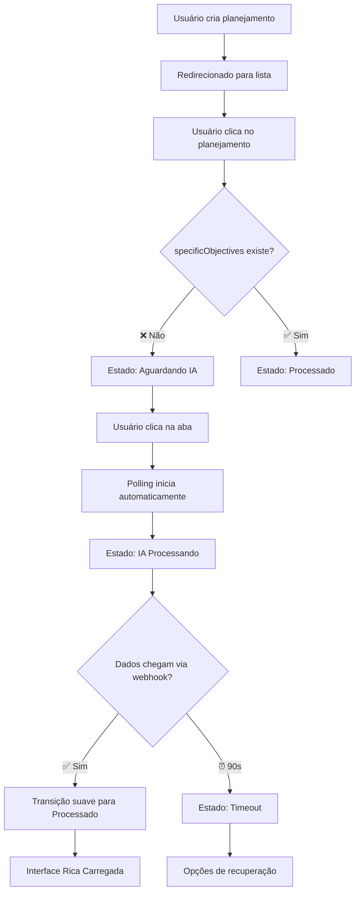
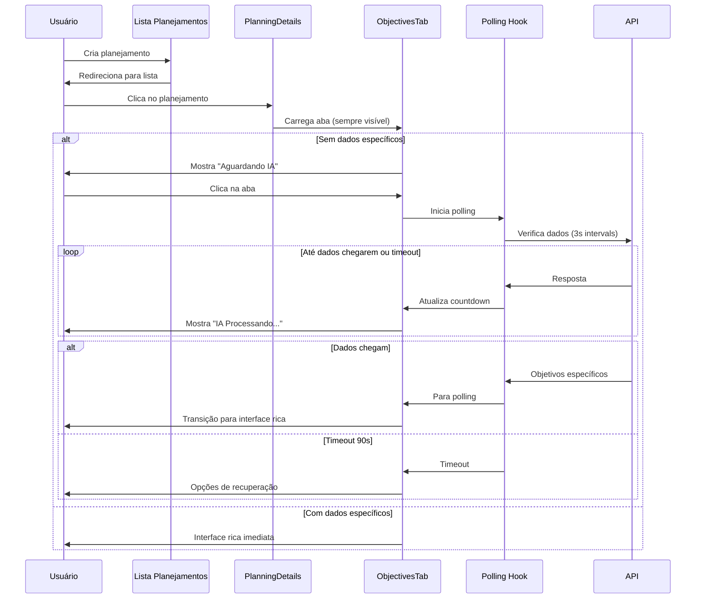

# Sistema de Aba Sempre Visível: Objetivos Específicos

## 📋 Problema Resolvido

**Antes**: A aba "Objetivos Específicos" só aparecia quando havia dados, causando confusão nos usuários que não sabiam onde encontrar essa funcionalidade.

**Agora**: A aba está **sempre visível** com estados visuais claros que indicam:
- 🟡 **Aguardando processamento** - IA ainda não iniciou
- 🔵 **IA processando** - Gerando objetivos específicos 
- 🟢 **Processado** - Dados disponíveis com interface rica

## 🎯 Fluxo de Estados Visuais



## 🔧 Implementação Técnica

### 1. **Estados da Aba no PlanningDetails**

```typescript
// ✅ NOVO: Estado da aba Objetivos Específicos (sempre visível)
const getObjectivesTabState = () => {
  if (hasSpecificObjectives || hasTasksForRefinement) {
    return 'ready'; // 🟢 Dados disponíveis
  }
  if (isObjectivesProcessing) {
    return 'generating'; // 🔵 IA está processando
  }
  return 'waiting'; // 🟡 Aguardando processamento da IA
};

const objectivesTabState = getObjectivesTabState();
```

### 2. **Interface Visual da Aba**

```jsx
<button onClick={() => setCurrentTab('objectives')} className="...">
  <span className="flex items-center space-x-2">
    {/* Ícone baseado no estado */}
    {objectivesTabState === 'generating' ? (
      <Loader2 className="h-4 w-4 animate-spin text-sgbus-green" />
    ) : objectivesTabState === 'waiting' ? (
      <Target className="h-4 w-4 text-seasalt/60" />
    ) : (
      <Target className="h-4 w-4" />
    )}
    
    <span>Objetivos Específicos</span>
    
    {/* Indicador de status */}
    {objectivesTabState === 'generating' && (
      <span className="text-xs bg-sgbus-green/20 text-sgbus-green px-2 py-1 rounded animate-pulse">
        IA Processando...
      </span>
    )}
    {objectivesTabState === 'waiting' && (
      <span className="text-xs bg-amber-500/20 text-amber-400 px-2 py-1 rounded">
        Aguardando IA
      </span>
    )}
    {objectivesTabState === 'ready' && (
      <span className="text-xs bg-green-500/20 text-green-400 px-2 py-1 rounded">
        ✨ Processado
      </span>
    )}
  </span>
  
  {/* Destaque visual para aba com atividade */}
  {objectivesTabState === 'generating' && (
    <div className="absolute -top-1 -right-1 w-2 h-2 bg-sgbus-green rounded-full animate-ping"></div>
  )}
</button>
```

### 3. **Conteúdo da Aba (ObjectivesTab)**

#### **🟡 Estado: Aguardando IA**
```jsx
<div className="text-center py-12">
  <div className="relative inline-block mb-6">
    <Target className="h-12 w-12 text-sgbus-green/60" />
    <div className="absolute -inset-2 border-2 border-sgbus-green/20 rounded-full animate-pulse"></div>
  </div>
  
  <h3 className="text-xl font-semibold text-seasalt mb-3">
    Objetivos Específicos
  </h3>
  
  <p className="text-seasalt/70 mb-6 max-w-md mx-auto">
    Os objetivos específicos para <strong>{client.name}</strong> 
    serão gerados automaticamente pela nossa IA.
  </p>
  
  <div className="bg-amber-500/10 border border-amber-500/20 rounded-lg p-4 inline-block">
    <div className="flex items-center gap-2 text-sm">
      <div className="w-2 h-2 bg-amber-400 rounded-full animate-ping"></div>
      <span className="text-amber-400 font-medium">Aguardando processamento da IA</span>
    </div>
  </div>
</div>
```

#### **🔵 Estado: IA Processando (com Countdown)**
```jsx
<div className="text-center py-12">
  <div className="relative inline-block mb-6">
    <Loader2 className="h-12 w-12 animate-spin text-sgbus-green" />
    <div className="absolute inset-0 h-12 w-12 rounded-full border-2 border-sgbus-green/20 animate-pulse"></div>
  </div>
  
  <h3 className="text-xl font-semibold text-seasalt mb-3">
    Gerando Objetivos Específicos...
  </h3>
  
  <p className="text-seasalt/70 mb-4 max-w-md mx-auto">
    Nossa IA está analisando os dados para <strong>{client.name}</strong>.
  </p>
  
  <div className="bg-eerie-black/50 rounded-lg p-4 inline-block">
    <div className="flex items-center gap-2 text-sm">
      <div className="w-2 h-2 bg-blue-400 rounded-full animate-ping"></div>
      <span className="text-seasalt/70">Tempo restante:</span>
      <span className="text-sgbus-green font-mono">01:23</span>
    </div>
  </div>
</div>
```

#### **🟢 Estado: Processado (Interface Rica)**
```jsx
<TaskRefinementInterface 
  planning={planning}
  onUpdate={(updatedPlanning) => {
    console.log('Planning atualizado:', updatedPlanning);
  }}
  onCreateRefinedTab={() => {
    console.log('Solicitação para criar aba refinada');
  }}
/>
```

## 🔄 Sistema de Polling Robusto

### **Condições de Inicialização**
```typescript
// ✅ LÓGICA MAIS ROBUSTA: Iniciar polling se não há dados
const hasData = initialData?.specificObjectives && 
               initialData.specificObjectives.trim().length > 0;

const shouldStartPolling = 
  planningId && 
  initialData && 
  !hasData && // Não tem dados ainda
  !hasTimedOut && // Não teve timeout ainda
  !shouldPoll; // Não está já fazendo polling
```

### **Auto-detecção de Dados**
```typescript
// ✅ PARAR POLLING quando dados chegam
if (hasData && shouldPoll) {
  console.log(`✅ [Polling ${planningId}] Dados encontrados - parando polling`);
  setShouldPoll(false);
  setStartTime(null);
}
```

### **Timeout e Recovery**
- ⏰ **90 segundos** de timeout máximo
- 🔄 **3 segundos** de intervalo entre verificações
- 🎯 **Recuperação automática** se dados chegam após timeout

## 🎨 Transições Visuais

### **Mudanças de Estado da Aba**
```css
.transition-colors {
  transition: color 0.3s ease, border-color 0.3s ease;
}

.animate-pulse {
  animation: pulse 2s cubic-bezier(0.4, 0, 0.6, 1) infinite;
}

.animate-ping {
  animation: ping 1s cubic-bezier(0, 0, 0.2, 1) infinite;
}
```

### **Indicadores de Status**
- 🟡 **Aguardando**: Amber com ping animation
- 🔵 **Processando**: Green com spin animation + countdown
- 🟢 **Pronto**: Green estático com ícone ✨

## 📊 Benefícios Implementados

### **Para o Usuário:**
- ✅ **Previsibilidade** - Sempre sabe onde encontrar objetivos específicos
- ✅ **Feedback visual** - Estado claro do processamento
- ✅ **Transição suave** - Do loading direto para interface rica
- ✅ **Contexto preservado** - Nome do cliente sempre visível
- ✅ **Controle temporal** - Countdown para expectativa realista

### **Para o Sistema:**
- ✅ **Polling inteligente** - Só ativa quando necessário
- ✅ **Auto-detecção** - Para automaticamente quando dados chegam
- ✅ **Timeout robusto** - 90s com opções de recuperação
- ✅ **Cache otimizado** - Atualização automática dos dados

### **Para Desenvolvedores:**
- ✅ **Estados claros** - Lógica bem definida para cada estado
- ✅ **Logs detalhados** - Facilita debugging e monitoramento
- ✅ **Componentes reutilizáveis** - LoadingState, ErrorState, etc.
- ✅ **TypeScript seguro** - Tipagem correta em todos os fluxos

## 🚀 Exemplo de Uso Completo



---

**Status**: ✅ Implementado e funcionando
**Compatibilidade**: Sistema de polling + Interface rica + Estados visuais
**Próximos passos**: Monitoramento de performance e ajustes baseados no uso real 