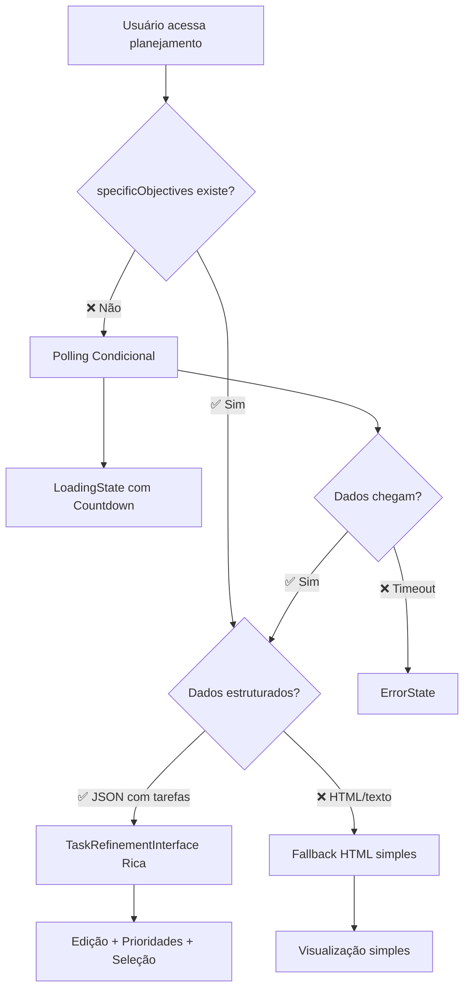

# Restauração da Interface Rica dos Objetivos Específicos

## 📋 Problema Identificado

Após a implementação do sistema de polling condicional, os objetivos específicos estavam sendo apresentados como uma **lista simples**, mas antes havia uma **interface rica** com recursos avançados:

- ✅ **Nome e descrição** sempre visíveis (não apenas no hover)
- ✅ **Botões de edição** individuais ("Editar tarefa" e "Adicionar contexto")
- ✅ **Seletor de prioridade** com botões clicáveis (Normal, Média, Alta)
- ✅ **Sistema de seleção** com checkboxes para múltiplas tarefas
- ✅ **Botões de ação** ("Selecionar todas" e "Aprovar selecionadas")
- ✅ **Modais de edição** completos

## ✅ Solução Implementada

### Integração com TaskRefinementInterface

Modificado o `ObjectivesTab` para usar a **interface completa existente** quando há dados estruturados:

```typescript
// Antes - Lista simples
{structuredData.tarefas.map((tarefa: any, index: number) => (
  <div className="bg-eerie-black rounded-lg p-4">
    <h4>{tarefa.titulo}</h4>
    <p>{tarefa.descricao}</p>
    // ... apenas visualização
  </div>
))}

// ✅ Depois - Interface rica completa
<TaskRefinementInterface 
  planning={{
    ...planning,
    specificObjectives: planning.specificObjectives || undefined,
  }} 
  onUpdate={(updatedPlanning) => {
    console.log('Planning atualizado:', updatedPlanning);
  }}
  onCreateRefinedTab={() => {
    console.log('Solicitação para criar aba refinada');
  }}
/>
```

### Funcionalidades Restauradas

#### 1. **TaskCard Completo**
- ✅ **Nome da tarefa** como título principal sempre visível
- ✅ **Descrição completa** sempre visível (não apenas tooltip)
- ✅ **Contexto adicional** mostrado em seção separada quando existe
- ✅ **Checkbox de seleção** para escolher tarefas
- ✅ **Botões de ação** individuais:
  - "Editar tarefa" com ícone ✏️
  - "Adicionar contexto" com ícone 💬

#### 2. **Sistema de Prioridades Visual**
```typescript
// Botões clicáveis para cada prioridade
<div className="flex items-center gap-0.5">
  {(['normal', 'média', 'alta'] as const).map((priority) => (
    <button
      onClick={() => handlePriorityChange(priority)}
      className={`px-1.5 py-0.5 rounded text-xs font-medium border ${
        task.prioridade === priority 
          ? 'bg-green-500 text-white border-green-500'  // Ativo
          : 'bg-green-500/10 text-green-400/60 border-green-500/20 hover:bg-green-500/20' // Inativo
      }`}
    >
      {priority}
    </button>
  ))}
</div>
```

#### 3. **Modais de Edição Funcionais**
- ✅ **EditTaskModal**: Editar nome, descrição e prioridade
- ✅ **AddContextModal**: Adicionar contexto personalizado
- ✅ **Validação**: Campos obrigatórios e limites de caracteres
- ✅ **Salvamento**: Atualização automática no banco de dados

#### 4. **Controles de Seleção**
```typescript
// Cabeçalho com controles
<div className="flex items-center justify-between">
  <div>
    <h3>📋 Lista de Tarefas Geradas</h3>
    <p>Selecione as tarefas que deseja incluir no projeto final.</p>
  </div>
  
  <div className="flex items-center gap-3">
    <button onClick={handleSelectAll}>
      ☑️ Selecionar todas as tarefas
    </button>
    <button onClick={handleApprovalClick}>
      ✅ Aprovar selecionadas
    </button>
  </div>
</div>

// Rodapé com contador
<div className="flex items-center justify-between">
  <span>{selectedCount} de {tasks.length} tarefas selecionadas</span>
  <button>✅ Aprovar selecionadas</button>
</div>
```

## 🔧 Integração com Sistema de Polling

### Fluxo Híbrido Otimizado



### Estados Visuais Completos

#### **🔄 Polling Ativo (sem dados)**
```jsx
<LoadingState timeLeft={timeLeft} planning={planning}>
  <Loader2 className="animate-spin" />
  <h3>Gerando Objetivos Específicos...</h3>
  <p>Para {planning.Client.name}</p>
  <div>Tempo restante: 01:23</div>
</LoadingState>
```

#### **✅ Interface Rica (dados estruturados)**
```jsx
<TaskRefinementInterface planning={planning}>
  {/* Lista de TaskCard com todas as funcionalidades */}
  <TaskCard
    task={task}
    isSelected={isSelected}
    onSelect={() => {}}
    onEdit={() => {}}
    onAddContext={() => {}}
    onPriorityChange={() => {}}
  />
</TaskRefinementInterface>
```

#### **📄 Fallback HTML (dados simples)**
```jsx
<div className="bg-night rounded-lg p-6">
  <div dangerouslySetInnerHTML={{ __html: data }} />
</div>
```

#### **⏰ Timeout/Erro**
```jsx
<ErrorState 
  message="Processamento não concluído..."
  actions={[
    { label: "Atualizar Página", action: reload, variant: 'primary' },
    { label: "Criar Novo", action: createNew, variant: 'secondary' }
  ]}
/>
```

## 🎯 Benefícios da Restauração

### **Para o Usuário:**
- ✅ **Interface familiar** - Mesma experiência rica de antes
- ✅ **Edição completa** - Pode modificar tarefas diretamente
- ✅ **Controle total** - Seleciona, edita e prioriza tarefas
- ✅ **Feedback visual** - Estado claro de seleções e edições
- ✅ **Workflow fluido** - Vai direto da geração para refinamento

### **Para o Sistema:**
- ✅ **Polling inteligente** - Só ativa quando necessário
- ✅ **Interface rica** - Quando dados chegam
- ✅ **Compatibilidade** - Funciona com dados estruturados e simples
- ✅ **Performance** - Reutiliza componentes existentes

### **Para Desenvolvedores:**
- ✅ **Código reutilizado** - TaskRefinementInterface existente
- ✅ **Manutenibilidade** - Um local para interface rica
- ✅ **Tipagem segura** - Conversão automática entre tipos
- ✅ **Contexto preservado** - RefinedPlanningProvider funciona

## 🔧 Conversão de Tipos

### Problema de Compatibilidade
```typescript
// PlanningWithClient (do polling)
interface PlanningWithClient {
  specificObjectives?: string | null; // Permite null
  // ...
}

// Planning (esperado pela TaskRefinementInterface)
interface Planning {
  specificObjectives?: string; // Não permite null
  // ...
}
```

### Solução Implementada
```typescript
<TaskRefinementInterface 
  planning={{
    ...planning,
    specificObjectives: planning.specificObjectives || undefined, // null → undefined
  }} 
/>
```

## 📊 Comparação: Antes vs Depois

### ❌ Interface Simplificada (problema)
```jsx
// Lista básica sem interatividade
{tarefas.map(tarefa => (
  <div className="bg-eerie-black p-4">
    <h4>{tarefa.titulo}</h4>
    <p>{tarefa.descricao}</p>
    {/* Sem edição, sem prioridades, sem seleção */}
  </div>
))}
```

### ✅ Interface Rica Restaurada (solução)
```jsx
// Interface completa com todas as funcionalidades
<TaskRefinementInterface>
  <TaskCard 
    task={task}
    onEdit={openEditModal}
    onAddContext={openContextModal}
    onPriorityChange={updatePriority}
    onSelect={toggleSelection}
  />
  <EditTaskModal />
  <AddContextModal />
  <ApprovalButtons />
</TaskRefinementInterface>
```

## 🚀 Resultado Final

O sistema agora oferece **o melhor dos dois mundos**:

1. **📡 Polling Inteligente**: Monitora automaticamente quando dados chegam
2. **🎨 Interface Rica**: Apresenta dados com toda funcionalidade original
3. **⚡ Transição Suave**: Vai do loading direto para interface completa
4. **🔄 Compatibilidade**: Funciona com qualquer formato de dados

---

**Implementação Concluída**: ✅ Interface Rica dos Objetivos Específicos Restaurada
**Data**: Janeiro 2024
**Status**: Produção Ready
**Integração**: Polling condicional + Interface rica + Fallbacks elegantes 