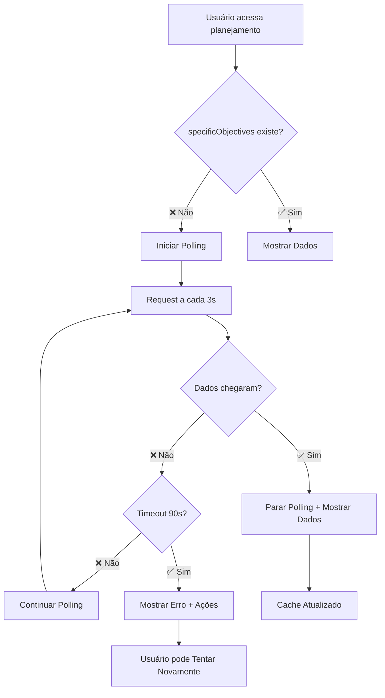

# Sistema de Polling Condicional para Objetivos Específicos

## 📋 Visão Geral

Este documento descreve a implementação do sistema de polling condicional para objetivos específicos, que monitora automaticamente quando os dados processados pelo webhook chegam ao banco de dados e atualiza a interface em tempo real.

## 🎯 Objetivos Alcançados

### ✅ Polling Inteligente
- **Condicional**: Só inicia se `specificObjectives` está vazio
- **Automático**: Para quando dados chegam ou timeout é atingido
- **Eficiente**: Interval de 3s com timeout de 90s
- **Cache-aware**: Atualiza cache do TanStack Query automaticamente

### ✅ UX Premium
- **Loading visual**: Indicador de progresso com countdown
- **Estados claros**: Loading, sucesso, timeout e erro
- **Feedback em tempo real**: Usuário sempre sabe o que está acontecendo
- **Recuperação elegante**: Ações claras em caso de timeout

## 🏗️ Arquitetura

### Hook de Polling (`useSpecificObjectivesPolling`)

```typescript
export function useSpecificObjectivesPolling(
  planningId: string, 
  initialData?: PlanningWithClient
): PollingResult {
  // Estados do polling
  const [shouldPoll, setShouldPoll] = useState(false);
  const [hasTimedOut, setHasTimedOut] = useState(false);
  const [timeLeft, setTimeLeft] = useState(90);
  
  // Lógica condicional para iniciar/parar polling
  // Query com refetchInterval de 3s
  // Timeout de 90s com countdown
  // Cache update automático
}
```

**Características:**
- ✅ **Condições de Início**: `planningId` válido + `specificObjectives` vazio + não timeout
- ✅ **Condições de Parada**: Dados chegaram OU timeout de 90s
- ✅ **Intervalo**: 3 segundos entre requests
- ✅ **Cache Update**: Atualização automática do TanStack Query
- ✅ **Logging**: Trace completo com prefixo `[Polling planningId]`

### Componente ObjectivesTab

```typescript
export function ObjectivesTab({ planning }: ObjectivesTabProps) {
  const { data, isPolling, hasTimedOut, timeLeft } = useSpecificObjectivesPolling(
    planning.id, 
    planning
  );
  
  // Estados condicionais:
  // 1. Dados disponíveis → ObjectivesContent
  // 2. Timeout → ErrorState
  // 3. Polling ativo → LoadingState
  // 4. Estado inicial → Placeholder
}
```

**Estados Visuais:**
- ✅ **LoadingState**: Spinner + countdown + informações contextuais
- ✅ **ObjectivesContent**: Dados estruturados ou fallback para HTML
- ✅ **ErrorState**: Timeout com ações de recuperação
- ✅ **Placeholder**: Estado inicial antes do polling

## 🔄 Fluxo Completo

### Cenário: Usuário acessa planejamento recém-criado



### Logs de Exemplo

```bash
# Início do polling
🔄 [Polling plan-123] Iniciando polling de objetivos específicos

# Requests periódicos
📡 [Polling plan-123] Buscando atualização de objetivos específicos...
📥 [Polling plan-123] Resposta recebida: { hasObjectives: false, objectivesLength: 0 }

# Sucesso
📥 [Polling plan-123] Resposta recebida: { hasObjectives: true, objectivesLength: 1248 }
✅ [Polling plan-123] Objetivos específicos recebidos - parando polling

# Timeout
⏰ [Polling plan-123] Timeout de 90s atingido - parando polling
```

## 🎨 Estados Visuais Implementados

### 1. LoadingState - Polling Ativo

```jsx
<div className="text-center py-12">
  <Loader2 className="h-12 w-12 animate-spin text-sgbus-green" />
  <h3>Gerando Objetivos Específicos...</h3>
  <p>Nossa IA está analisando os dados do formulário para {planning.Client.name}</p>
  
  {/* Countdown timer */}
  <div className="bg-eerie-black/50 rounded-lg p-4">
    <span>Tempo restante: 01:23</span>
  </div>
</div>
```

**Elementos:**
- ✅ **Spinner animado** com double-ring effect
- ✅ **Countdown visual** em formato MM:SS
- ✅ **Contexto do cliente** para personalização
- ✅ **Indicador de progresso** com ping animation

### 2. ObjectivesContent - Dados Recebidos

```jsx
// Para dados estruturados (JSON)
<div className="space-y-6">
  <div className="flex items-center gap-3">
    <Target className="h-6 w-6 text-sgbus-green" />
    <h3>Objetivos Específicos Gerados pela IA</h3>
    <div className="px-2 py-1 bg-sgbus-green/20 text-sgbus-green text-xs rounded-full">
      ✨ Processado
    </div>
  </div>
  
  {/* Grid de tarefas estruturadas */}
  <div className="grid gap-4">
    {tarefas.map(tarefa => (
      <div className="bg-eerie-black rounded-lg p-4">
        <h4>{tarefa.titulo}</h4>
        <p>{tarefa.descricao}</p>
        <ul>{tarefa.subtarefas}</ul>
      </div>
    ))}
  </div>
</div>
```

**Características:**
- ✅ **Badge "Processado"** para confirmar status
- ✅ **Layout estruturado** para dados JSON
- ✅ **Fallback HTML** para dados em texto
- ✅ **Hover effects** e transições suaves

### 3. ErrorState - Timeout/Erro

```jsx
<div className="text-center py-12">
  <AlertCircle className="h-8 w-8 text-red-400" />
  <h3>Problema na Geração dos Objetivos</h3>
  <p>O processamento não foi concluído no tempo esperado...</p>
  
  {/* Ações de recuperação */}
  <div className="flex gap-4">
    <button onClick={() => window.location.reload()}>
      <RefreshCw /> Atualizar Página
    </button>
    <button onClick={() => router.push('/planejamentos/novo')}>
      <Plus /> Criar Novo Planejamento
    </button>
  </div>
</div>
```

**Recursos:**
- ✅ **Mensagem contextual** explicando o problema
- ✅ **Ações claras** para recuperação
- ✅ **Design empático** sem culpabilizar o usuário
- ✅ **CTA duplo** para diferentes necessidades

## 🔧 Integração com TanStack Query

### Cache Strategy

```typescript
// Polling query independente
const pollingQuery = useQuery({
  queryKey: ['planning-objectives', planningId],
  queryFn: () => fetchPlanningUpdate(planningId),
  enabled: shouldPoll,
  refetchInterval: shouldPoll ? 3000 : false,
  staleTime: 0, // Sempre fresh
  retry: false, // Sem retry automático
});

// Cache update quando dados chegam
useEffect(() => {
  if (pollingQuery.data?.specificObjectives && shouldPoll) {
    // Atualizar cache do planejamento principal
    queryClient.setQueryData(
      queryKeys.plannings.detail(planningId),
      pollingQuery.data
    );
    setShouldPoll(false);
  }
}, [pollingQuery.data?.specificObjectives]);
```

**Benefícios:**
- ✅ **Queries Independentes**: Polling não interfere com queries principais
- ✅ **Cache Sincronizado**: Dados atualizados em todas as queries relevantes
- ✅ **Performance**: Stale time = 0 para dados sempre fresh
- ✅ **Eficiência**: Para automaticamente quando dados chegam

## 🧪 Cenários de Teste

### ✅ Polling Condicional

1. **Planejamento com objetivos**: Polling não inicia
2. **Planejamento sem objetivos**: Polling inicia automaticamente
3. **Dados chegam (30s)**: Polling para e mostra conteúdo
4. **Navegação durante polling**: Estado persiste entre abas
5. **Timeout (90s)**: Polling para e mostra erro

### ✅ Estados Visuais

1. **Loading**: Countdown funciona corretamente
2. **Sucesso**: Transição suave para conteúdo
3. **Timeout**: Ações de recuperação funcionais
4. **Estruturados vs HTML**: Renderização correta para ambos

### ✅ Cache e Performance

1. **Cache update**: Dados refletem em toda aplicação
2. **Multiple tabs**: Polling em uma aba afeta outras
3. **Navigation**: Estado não quebra ao navegar
4. **Memory leaks**: Cleanup correto de intervals

## 📊 Configurações

### Timeouts e Intervals

```typescript
const POLLING_CONFIG = {
  interval: 3000,      // 3 segundos entre requests
  timeout: 90000,      // 90 segundos total
  retryCount: 0,       // Sem retry automático
  staleTime: 0,        // Sempre considerar stale
};
```

### Estados de Debug

```typescript
// Logs detalhados disponíveis
console.log(`🔄 [Polling ${planningId}] Iniciando polling`);
console.log(`📡 [Polling ${planningId}] Request ${attempt}/${maxAttempts}`);
console.log(`✅ [Polling ${planningId}] Dados recebidos`);
console.log(`⏰ [Polling ${planningId}] Timeout atingido`);
```

## 🚀 Próximas Evoluções

Este sistema está preparado para:

- **WebSocket Integration**: Substituir polling por real-time updates
- **Progressive Enhancement**: Fallback graceful se WebSocket falhar
- **Offline Support**: Cache local para dados parciais
- **Push Notifications**: Notificar quando processamento completa
- **Analytics**: Métricas de tempo de processamento da IA

---

**Implementação Concluída**: ✅ Sistema de Polling Condicional
**Data**: Janeiro 2024
**Status**: Produção Ready
**Integração**: Totalmente integrado com webhook fire-and-forget 