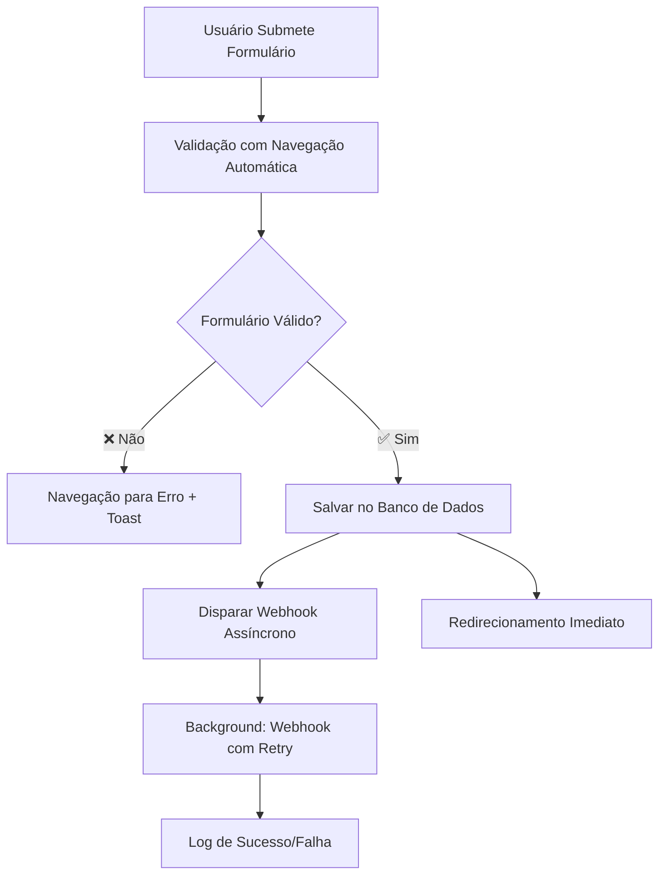

# Sistema de Webhook Fire-and-Forget

## 📋 Visão Geral

Este documento descreve a implementação do sistema de webhook fire-and-forget para planejamentos estratégicos, que **separa completamente** as ações de salvamento no banco de dados e envio para API externa.

## 🎯 Objetivos Alcançados

### ✅ Separação Total de Responsabilidades

- **Banco de Dados**: Ação prioritária que bloqueia o fluxo do usuário
- **Webhook**: Ação secundária totalmente independente em background
- **UX**: Usuário nunca aguarda resposta de API externa

### ✅ Performance e Confiabilidade

- **Redirecionamento Imediato**: <2 segundos após salvamento no banco
- **Sistema Resiliente**: Funciona independente do status da API externa
- **Retry Automático**: 3 tentativas com delay de 2s entre elas
- **Timeout Controlado**: 30s por tentativa de webhook

## 🏗️ Arquitetura

### Fluxo de Submissão do Formulário



### Componentes Principais

#### 1. **WebhookService** (`lib/planning/webhookService.ts`)

```typescript
// Singleton service para gerenciar webhooks
const webhookService = WebhookService.getInstance();

// Fire-and-forget - não bloqueia nem aguarda resultado
webhookService.triggerWebhookAsync(
  planningId,
  client,
  formData,
  userId
);
```

**Características:**
- ✅ **Singleton Pattern**: Uma instância para toda aplicação
- ✅ **Fire-and-Forget**: `setImmediate()` para execução não-bloqueante
- ✅ **Retry Automático**: 3 tentativas com backoff exponencial
- ✅ **Timeout Controlado**: 30s por requisição
- ✅ **Logging Detalhado**: Trace completo de cada tentativa
- ✅ **Configurável**: Options para retry, delay e timeout

#### 2. **API Route** (`app/api/plannings/route.ts`)

```typescript
// ✅ AÇÃO 1: SALVAR NO BANCO (PRIORITÁRIA)
const planning = await prisma.strategicPlanning.create({...});

// ✅ AÇÃO 2: WEBHOOK INDEPENDENTE (FIRE-AND-FORGET)
webhookService.triggerWebhookAsync(
  planning.id,
  client,
  data.formDataJSON,
  user.id
).catch(error => {
  // Log interno apenas - não afeta a resposta
  console.error(`Erro interno no webhook: ${error}`);
});

// ✅ RESPOSTA IMEDIATA
return NextResponse.json(planning, { status: 201 });
```

**Mudanças Implementadas:**
- ❌ **Removido**: `await` no webhook que bloqueava resposta
- ✅ **Adicionado**: Disparo assíncrono com `.catch()` para logs
- ✅ **Garantido**: Resposta sempre retorna após salvamento no banco

#### 3. **Formulário Client** (`components/planning/PlanningFormWithClient.tsx`)

```typescript
// ✅ ÚNICA OPERAÇÃO QUE BLOQUEIA O FLUXO
const createdPlanning = await createPlanningMutation.mutateAsync({...});

// ✅ WEBHOOK TOTALMENTE INDEPENDENTE
console.log('📡 Webhook disparado automaticamente em background pela API');

// ✅ REDIRECIONAMENTO IMEDIATO
router.push(`/planejamentos?highlight=${createdPlanning.id}`);
```

**UX Melhorada:**
- ✅ **Toast Informativo**: "Os objetivos específicos serão gerados automaticamente"
- ✅ **Loading Claro**: "Processando dados no sistema" (não menciona webhook)
- ✅ **Erro Específico**: Apenas erros de banco afetam o usuário

## 🔧 Configuração

### Variáveis de Ambiente

```bash
# URL do webhook (obrigatória para envio)
PLANNING_WEBHOOK_URL=https://api.external.com/webhook

# Secret para autenticação (opcional)
WEBHOOK_SECRET=seu-secret-aqui

# URL da aplicação (para X-Origin-Domain header)
NEXT_PUBLIC_APP_URL=https://yourapp.com
```

### Headers Enviados no Webhook

```typescript
{
  'Content-Type': 'application/json',
  'X-Webhook-Secret': process.env.WEBHOOK_SECRET || '',
  'X-Origin-Domain': process.env.NEXT_PUBLIC_APP_URL,
  'User-Agent': 'Vortex-Planning-System/1.0'
}
```

## 📊 Payload do Webhook

```json
{
  "planning_id": "uuid",
  "timestamp": "2024-01-01T12:00:00.000Z",
  "client_info": {
    "id": "client-uuid",
    "name": "Nome do Cliente",
    "industry": "Tecnologia",
    "richnessScore": 85,
    "businessDetails": "Detalhes...",
    "data_quality": "alto"
  },
  "form_submission_data": { ... },
  "context_enrichment": {
    "client_richness_level": "alto",
    "industry_specific_insights": true,
    "personalization_level": "avançado",
    "recommended_task_complexity": "avançado"
  },
  "submission_metadata": {
    "user_id": "user-uuid",
    "submitted_at": "2024-01-01T12:00:00.000Z",
    "form_version": "1.0",
    "session_id": "session_uuid"
  }
}
```

## 🔍 Monitoramento e Debugging

### Logs do Webhook

```bash
# Início do processo
📡 [Webhook planning-id] Iniciando envio assíncrono para: https://...
🔄 [Webhook planning-id] Configuração: maxRetries=3, timeout=30000ms

# Tentativas
⏳ [Webhook planning-id] Tentativa 1 falhou, aguardando 2000ms para retry...
❌ [Webhook planning-id] Erro na tentativa 2/3: Network timeout

# Sucesso
✅ [Webhook planning-id] Enviado com sucesso na tentativa 2/3
📥 [Webhook planning-id] Resposta recebida: 200 OK

# Falha final
🚨 [Webhook planning-id] FALHA FINAL - Todas as 3 tentativas falharam
```

### Estrutura de Logs

- **Prefixo Único**: `[Webhook planning-id]` para fácil filtragem
- **Emojis Distintivos**: 📡 📤 ✅ ❌ ⏳ 🚨 para identificação visual
- **Informações Detalhadas**: Status HTTP, corpo da resposta, configurações
- **Rastreabilidade**: Cada planning tem trace completo independente

## 🧪 Cenários de Teste

### ✅ Cenários de Sucesso

1. **Banco OK + Webhook OK**: Fluxo completo normal
2. **Banco OK + Webhook Falha**: Usuário não é afetado, sistema continua
3. **Banco OK + Webhook Timeout**: Sistema resiliente, logs adequados

### ❌ Cenários de Falha

1. **Banco Falha**: Usuário vê erro, webhook não executa
2. **Webhook Indisponível**: Sistema continua, logs de falha
3. **Webhook URL Inválida**: Graceful degradation

### 🔄 Cenários de Retry

1. **Falha Temporária**: Retry automático após 2s
2. **Timeout**: Retry com nova tentativa completa  
3. **Falha Persistente**: Log de falha final após 3 tentativas

## 📈 Benefícios Alcançados

### Para o Usuário
- ✅ **Resposta Imediata**: Redirecionamento após <2s
- ✅ **Feedback Claro**: Sabe que objetivos específicos estão sendo processados
- ✅ **Sistema Confiável**: Nunca trava por problemas externos

### Para o Sistema
- ✅ **Performance**: API responde rapidamente
- ✅ **Resilência**: Falhas de webhook não afetam operação
- ✅ **Observabilidade**: Logs detalhados para debugging
- ✅ **Escalabilidade**: Webhook processing não bloqueia requests

### Para Desenvolvedores
- ✅ **Separação Clara**: Responsabilidades bem definidas
- ✅ **Testabilidade**: Fluxos independentes para testar
- ✅ **Manutenibilidade**: Código modular e documentado
- ✅ **Debugging**: Logs estruturados e rastreáveis

## 🚀 Próximos Passos

Este sistema está preparado para:

- **Sistema de Polling**: Para verificar quando objetivos específicos chegam
- **Notificações**: Push notifications quando processamento completa
- **Métricas**: Dashboard de success rate e performance de webhooks
- **Queue System**: Migração para sistema de filas se necessário

---

**Implementação Concluída**: ✅ Sistema de Webhook Fire-and-Forget
**Data**: Janeiro 2024
**Status**: Produção Ready 